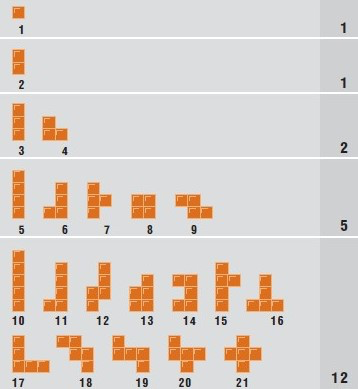

# AI-blokus-tournament

Les pièces du jeu il y a :
- 1 pièce d’un carré.
- 1 pièce à deux carrés.
- 2 pièces à trois carrés.
- 5 pièces à quatre carrés.
- 12 pièces à cinq carrés.



But du jeu :
Le but du jeu est, pour chaque joueur, de placer ses 21 pièces sur le plateau (ou en tous les cas, un maximum d’entre elles).

> Si vous effectuez une action interdite, vous perdez la partie.

### Execution

Pour lancer le jeu, il suffit de faire `python3 main.py [PLAYER_NB] [PATH_TO_PLAYER_1] ...`  
`[PLAYER_NB]` est le nombre de joueurs.  
`[PATH_TO_PLAYER_1]` est le chemin vers le fichier du premier joueur.  
`...` sont les chemins vers les fichiers des autres joueurs.  

Votre fichier doit être un executable.

### Commandes du jeu

> Aucune réponse est attendue de votre part

--------------------------------------------------------------------------------

`START [SIZE]`   
Instruction pour vous informer de la taille de la map.  
`[SIZE]` est la taille de la map (en nombre de carrés).  
Ce nombre est soit 14, soit 20.

--------------------------------------------------------------------------------

`PLAYER [PLAYER_NUMBER]`  
Instruction pour vous informer de votre numéro de joueur.  
`[PLAYER_NUMBER]` est le numéro du joueur.  
Ce nombre est soit 0, soit 1 si la taille de la map est de 14 et 0, 1, 2 ou 3 si la taille de la map est 20.

--------------------------------------------------------------------------------

`PLAY`  
Instruction pour vous informer que c'est votre tour.

--------------------------------------------------------------------------------

`PLAYED [PLAYER] [PIECE] [x] [y] [rotation]`  
Instruction pour vous informer que quelqu'un a joué une pièce.  
`[PLAYER]` est le numéro du joueur qui a joué.  
`[PIECE]` est le numéro de la pièce qui a été jouée.  
`[x]` et `[y]` sont les coordonnées de la case où la pièce a été jouée.  
`[rotation]` est l'angle de rotation de la pièce.  


### Commandes du joueur

> Les commandes ne seront prisent en compte que à votre tour.
--------------------------------------------------------------------------------

`BOARD`  
Instruction pour demander la map.

Réponse :
```
OOOOOOOOO\n
OOOOOOOOO\n
OOOOOOOOO\n
OOOOOOOOO\n
DONE\n
```
Représentation de l'état actuel de la map.

--------------------------------------------------------------------------------

`PIECES`   
Instruction pour demander vos pièces restantes.

Réponse :
```
1\n
2\n
3\n
5\n
6\n
8\n
20\n
DONE\n
```
Représentation de vos pièces restantes.

--------------------------------------------------------------------------------

`PIECE [PIECE]`  
Instruction pour demander l'état de la pièce `[PIECE]`.  
`[PIECE]` est le numéro de la pièce.

Réponse :
```
ALREADY PLACED\n
DONE\n
```
ou
```
OOOOO\n
OOOOO\n
OOXOO\n
OOOOO\n
OOOOO\n 
DONE\n
``` 
Représentation de l'état de la pièce dans votre inventaire.

--------------------------------------------------------------------------------


`PLAY [PIECE] [x] [y] [rotation]`  
Instruction pour jouer une pièce.  
`[PIECE]` est le numéro de la pièce.  
`[x]` et `[y]` sont les coordonnées de la pièce.  
`[rotation]` est l'angle de rotation de la pièce. (0, 90, 180 ou 270 clockwise)  

La rotation se fait par rapport au centre de la pièce.
La position placée est le centre de la pièce.

Réponse :  
```
DONE\n
```
--------------------------------------------------------------------------------

`SURRENDER` 
Instruction pour abandonner la partie.

Réponse :  
```
DONE\n
``` 

